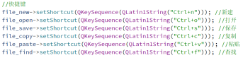
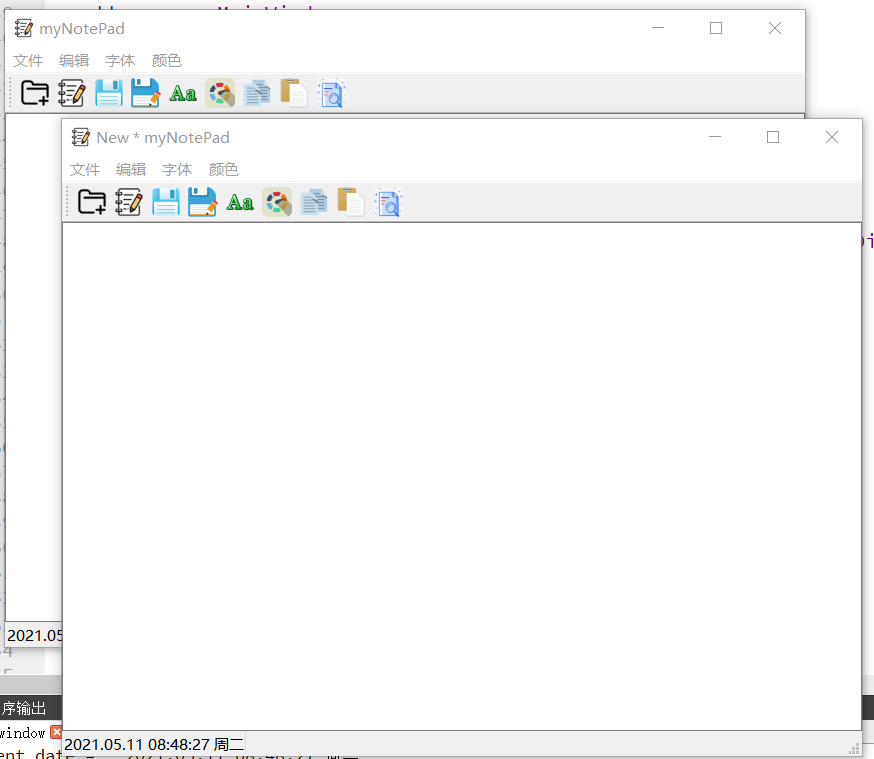

# QT实现文本编辑器
QT Homework
Date：2021 / 5 / 9
项目：
QT 文本编辑器
### 实现功能：
            1.文本编辑
            2.新建文本        
            3.打开文件与保存文件
            4.另存为
            5.字体设置
            6.颜色设置
            7.复制与粘贴
            8.查找
            9.键盘快捷键

### 问题：
            某些文本乱码。
            只支持UTF-8编码。

